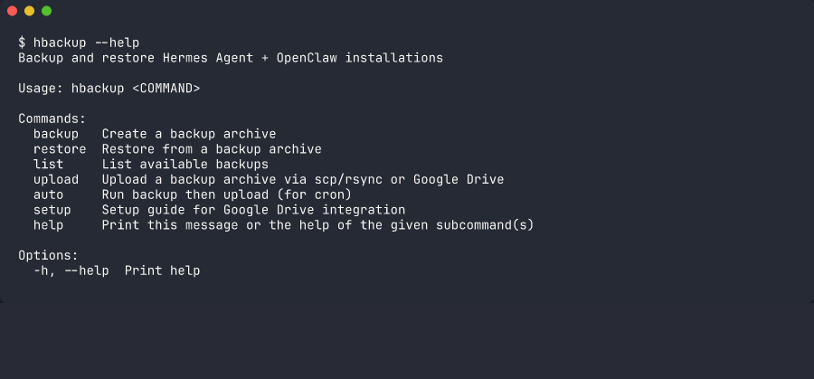

# hbackup

Backup and restore tool for Hermes Agent + OpenClaw installations.



## Features

- **Incremental-aware discovery**: Backs up `~/.hermes`, `~/.openclaw`, systemd units, and more
- **SQLite-safe**: Uses `sqlite3 .backup` for live database copies
- **Compressed archives**: `tar.zst` format with zstd compression
- **Google Drive upload**: Via `rclone` integration
- **Cross-platform home dir**: Uses `dirs` crate — no hardcoded paths
- **Auto workspace discovery**: Scans `~/.openclaw/workspace*` dynamically

## Install

```bash
cd tools/hbackup
cargo build --release
cp target/release/hbackup ~/.local/bin/
```

## Usage

### Backup

```bash
# Create backup
hbackup backup

# Dry run
hbackup backup --dry-run

# Custom output
hbackup backup -o /mnt/external/my-backup.tar.zst

# Exclude patterns
hbackup backup -x target -x .git
```

### Restore

```bash
# Restore from archive
hbackup restore ~/backups/hermes-openclaw-backup-20260101-120000.tar.zst

# Dry run
hbackup restore --dry-run ~/backups/...

# Force overwrite
hbackup restore --force ~/backups/...
```

### List Backups

```bash
hbackup list
```

### Upload to Google Drive

```bash
# Setup guide
hbackup setup drive

# Upload to Google Drive (requires rclone configured)
hbackup upload --drive ~/backups/hermes-openclaw-backup-*.tar.zst

# Custom remote name / folder
hbackup upload --drive --drive-remote mygdrive --drive-folder backups/2026 ~/backups/...
```

### Auto (backup + upload)

```bash
# Create backup then upload to configured destination
hbackup auto
```

Configure `~/.config/hbackup/config.toml`:

```toml
[upload]
destination = "user@server:/backups/"  # scp/rsync
drive_remote = "gdrive"                  # Google Drive remote name
drive_folder = "backups/hermes"          # Google Drive folder

[paths]
# Additional directories to include in every backup
extra = ["~/work/my-project"]
# Directories to exclude entirely from every backup
exclude = ["~/work/hermes-agent"]
```

## Cron Setup

```bash
# Daily backup at 3 AM
0 3 * * * /home/USER/.local/bin/hbackup auto >> /home/USER/.local/state/hermes/hbackup-cron.log 2>&1
```

## Config File

`~/.config/hbackup/config.toml`:

```toml
[upload]
# For scp/rsync upload:
method = "scp"  # or "rsync"
destination = "user@backup-server:/backups/"

# For Google Drive upload:
drive_remote = "gdrive"
drive_folder = "backups/hermes"

[paths]
# Extra directories to add to every backup (supports ~)
extra = ["~/work/my-project", "~/documents/configs"]
# Directories to exclude entirely from every backup (supports ~)
exclude = ["~/work/hermes-agent"]
```

## What Gets Backed Up

| Path | Description |
|------|-------------|
| `~/.hermes` | Hermes state, logs, cache |
| `~/work/openclaw` | OpenClaw workspace |
| `~/.openclaw` | OpenClaw config, workspaces (auto-discovered) |
| `~/.config/systemd/user/` | User systemd units |
| SQLite databases | Copied safely via `sqlite3 .backup` |

Extra paths can be added via the `[paths]` section of the config file.

## Open Source Notes

This tool was extracted from a personal setup. Before publishing:

- All hardcoded paths removed (uses `dirs::home_dir()`)
- Workspace names auto-discovered from `~/.openclaw/workspace*`
- No user-specific paths remain; extra paths configurable via `[paths]` in `~/.config/hbackup/config.toml`

## License

MIT
